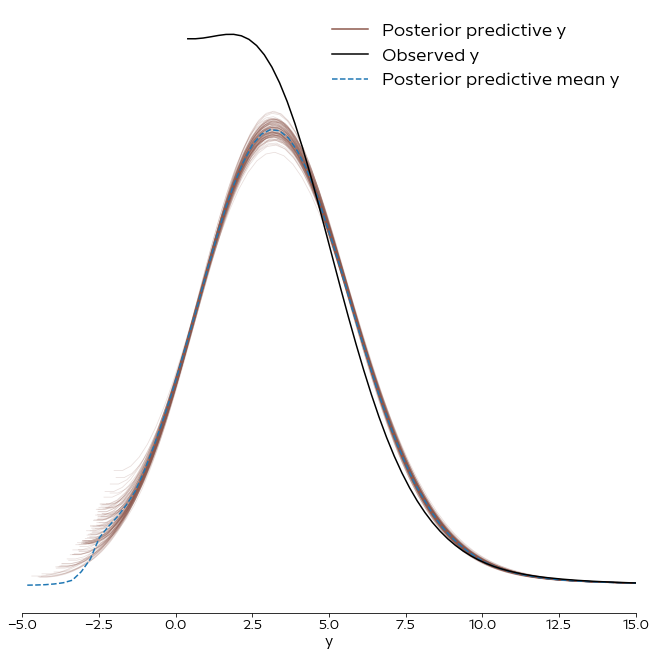

```python
import sys
sys.path.append('../src/')

import numpy as np
import pandas as pd
import pymc3 as pm
import arviz as az

import matplotlib.pyplot as plt
from utils.data_utils import load_data
from utils.plot_utils import set_plot_defaults
```

    /home/corrie/.pyenv/versions/anaconda3-2019.03/lib/python3.7/site-packages/xarray/core/merge.py:17: FutureWarning: The Panel class is removed from pandas. Accessing it from the top-level namespace will also be removed in the next version
      PANDAS_TYPES = (pd.Series, pd.DataFrame, pd.Panel)


```python
set_plot_defaults()
d, _, _ = load_data()
```


```python
inf_data = az.from_netcdf("../models/centered_hier.nc")
inf_data
```


    Inference data with groups:
    	> posterior
    	> sample_stats
    	> posterior_predictive
    	> prior
    	> observed_data


```python
ax = az.plot_ppc(inf_data, kind="density", num_pp_samples=100)
ax[0].spines["top"].set_visible(False)  
ax[0].spines["right"].set_visible(False)
ax[0].spines["left"].set_visible(False)
ax[0].set_xlim(-5, 15)
ax[0].legend(frameon=False,  markerscale=3., loc="upper right")
plt.show()
```





```python
az.__version__
```


    '0.5.1'


```python

```
