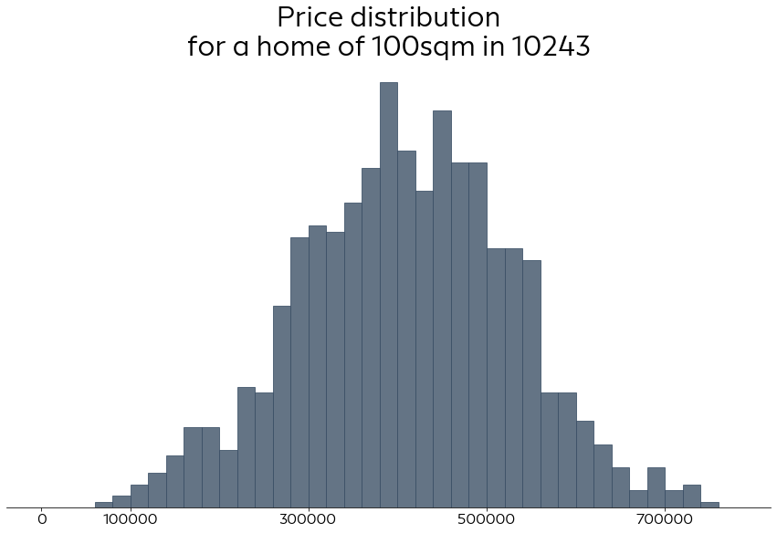
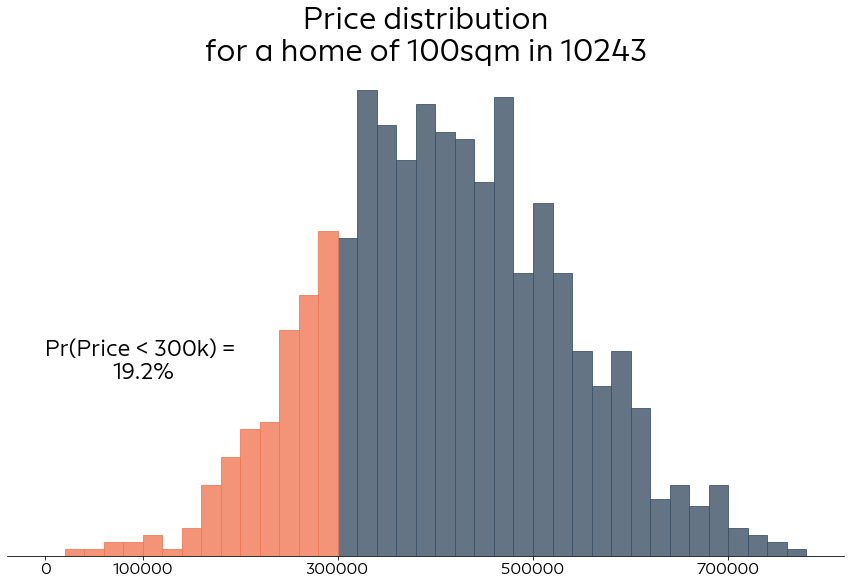
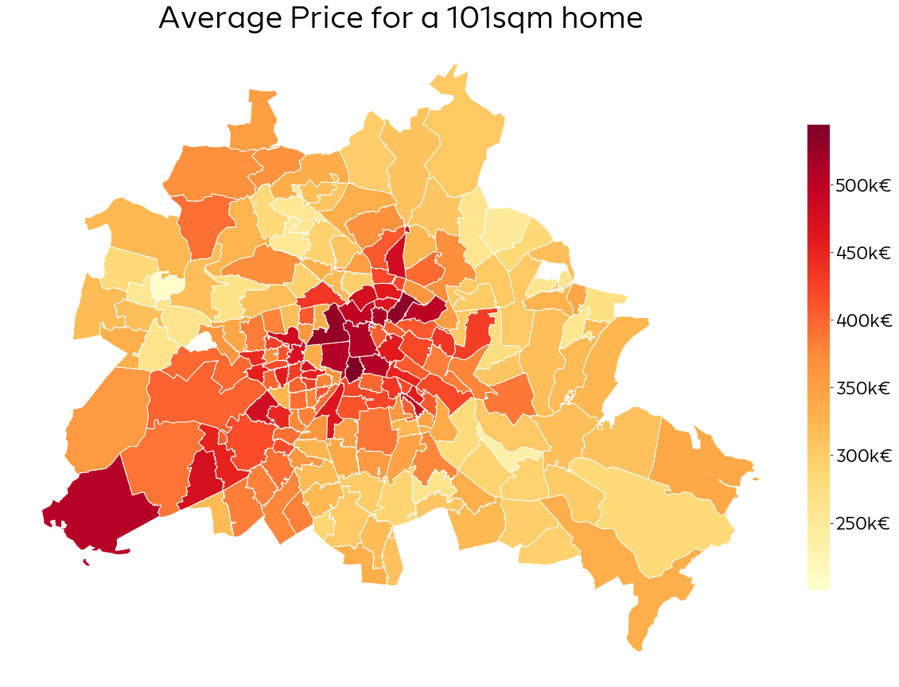
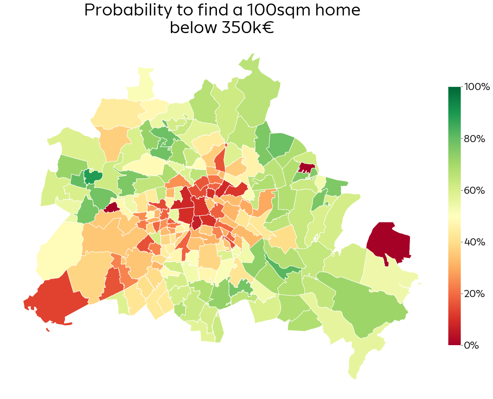

```python
import sys
sys.path.append('../src/')

import numpy as np
import xarray as xr
import pandas as pd
import geopandas as gpd
import pymc3 as pm
import arviz as az
import theano
import matplotlib.pyplot as plt
from matplotlib.ticker import StrMethodFormatter, PercentFormatter

from utils.data_utils import load_data, standardize_area, map_zip_codes
from utils.plot_utils import set_plot_defaults, plot_pred_hist
```

    /home/corrie/.pyenv/versions/anaconda3-2019.03/lib/python3.7/site-packages/xarray/core/merge.py:17: FutureWarning: The Panel class is removed from pandas. Accessing it from the top-level namespace will also be removed in the next version
      PANDAS_TYPES = (pd.Series, pd.DataFrame, pd.Panel)
    WARNING (theano.tensor.blas): Using NumPy C-API based implementation for BLAS functions.


```python
set_plot_defaults("Europace Sans")
d, zip_lookup, num_zip_codes = load_data()
zip_codes = np.sort(d.zip.unique())
target = "price_s"
```


```python
data = az.from_netcdf("../models/centered_hier.nc")
data
```


    Inference data with groups:
    	> posterior
    	> sample_stats
    	> posterior_predictive
    	> prior
    	> observed_data
    	> constant_data


```python
zips = theano.shared(d["zip_code"].values)
# idx variables cannnot used with pm.Data() so far, because of bug
# see here: https://discourse.pymc.io/t/integer-values-with-pm-data/3776
# and here: https://github.com/pymc-devs/pymc3/issues/3493

with pm.Model() as centered_hier_model:
    area = pm.Data("area", d["living_space_s"])
    #zips = pm.Data("zips", d["zip_code"].values)
    
    mu_alpha = pm.Normal("mu_alpha", mu=0, sd=20)
    sigma_alpha = pm.Exponential("sigma_alpha", lam=1/5)
    
    mu_beta = pm.Normal("mu_beta", mu=0, sd=5)
    sigma_beta = pm.Exponential("sigma_beta", lam=1/5)
    
    alpha = pm.Normal("alpha", mu=mu_alpha, sd=sigma_alpha, shape=num_zip_codes)
    beta = pm.Normal("beta", mu=mu_beta, sd=sigma_beta, shape=num_zip_codes)
    # without varying sigma
    sigma = pm.Exponential("sigma", lam=1/5)
    
    mu = alpha[zips] + beta[zips]*area
    y = pm.Normal("y", mu=mu, sd=sigma, observed=d[target])
    
    trace = pm.load_trace("../models/centered_hier/")
```


```python
more_houses = pd.DataFrame({"area": standardize_area(np.array([100, 240, 74]), d=d), "zip_code": ["10243", "10179", "12047"]})
```


```python
more_houses["zip"] = map_zip_codes(more_houses["zip_code"])
```


```python
with centered_hier_model:
    zips.set_value(more_houses["zip"])
    pm.set_data({"area": more_houses["area"]})
    post_pred = pm.sample_posterior_predictive(trace, samples=1000)
```

    100%|██████████| 1000/1000 [00:01<00:00, 500.80it/s]


```python
post_pred["y"].shape
```


    (1000, 3)


```python
y_pred = post_pred["y"][:,0]*100000
```


```python
plot_pred_hist(y_pred, title="Price distribution\nfor a home of 100sqm in 10243")
plt.show()
```





```python
plot_pred_hist(y_pred, threshold=300000, title="Price distribution\nfor a home of 100sqm in 10243")
plt.show()
```





```python
zip_shapes = gpd.read_file('../data/shapefiles/plz-gebiete/plz-gebiete.shp')
berlin_shapes = zip_shapes[zip_shapes.note.str.contains("Berlin")]
```


```python
zip_median = data.posterior.stack(samples=["draw", "chain"]).reset_index("samples")["alpha"].groupby("zip_code").median(dim="samples").to_dataframe()
```


```python
berlin_shapes = berlin_shapes.join(zip_median, on="plz")
```


```python
berlin_shapes = berlin_shapes.to_crs({'init': 'epsg:3395'})
```


```python
berlin_shapes["alpha"] = berlin_shapes["alpha"] * 100
```


```python
fig, ax = plt.subplots(figsize=(25,15))
vmin = berlin_shapes.alpha.min()
vmax = berlin_shapes.alpha.max()

ax = berlin_shapes.dropna().plot(column="alpha", ax=ax, edgecolor="white", cmap="YlOrRd")

ax.axis("off")
sm = plt.cm.ScalarMappable(cmap="YlOrRd", norm=plt.Normalize(vmin, vmax))
sm._A = []
cbar = fig.colorbar(sm, ax=ax, spacing="proportional", format=StrMethodFormatter("{x:.0f}k€"), 
                     fraction=0.021, pad=0.01)
cbar.outline.set_edgecolor("white")
cbar.ax.tick_params(labelsize=22)
ax.set_title("Average Price for a 101sqm home", fontsize=38)
plt.show()
```





```python
more_houses = pd.DataFrame({"area": standardize_area(np.array([100]*num_zip_codes), d=d), "zip_code": zip_codes})
```


```python
more_houses["zip"] = map_zip_codes(more_houses["zip_code"])
```


```python
with centered_hier_model:
    zips.set_value(more_houses["zip"])
    pm.set_data({"area": more_houses["area"]})
    post_pred = pm.sample_posterior_predictive(trace, samples=1000)
```

    100%|██████████| 1000/1000 [00:02<00:00, 497.26it/s]


```python
pred = xr.DataArray(post_pred["y"], dims=("samples", "zip_code"), coords={"zip_code": zip_codes})
```


```python
pred_df = pred.groupby("zip_code").apply(lambda x: np.mean(x < 3.5)).rename("prob").to_dataframe()
```


```python
berlin_shapes = berlin_shapes.join(pred_df, on="plz")
```


```python
fig, ax = plt.subplots(figsize=(25,15))
vmin = 0
vmax = 1 

ax = berlin_shapes.plot(column="prob", ax=ax, edgecolor="white", cmap="RdYlGn",vmin=vmin, vmax=vmax)

ax.axis("off")
sm = plt.cm.ScalarMappable(cmap="RdYlGn", norm=plt.Normalize(0, 100))
sm._A = []
cbar = fig.colorbar(sm, ax=ax, spacing="proportional", format=PercentFormatter(), 
                     fraction=0.021, pad=0.01)
cbar.outline.set_edgecolor("white")
cbar.ax.tick_params(labelsize=22)
ax.set_title("Probability to find a 100sqm home\nbelow 350k€", fontsize=38)
plt.show()
```




