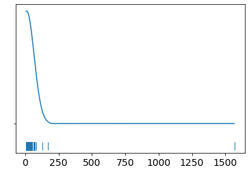
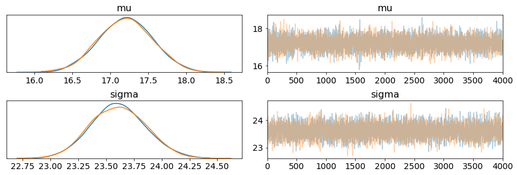
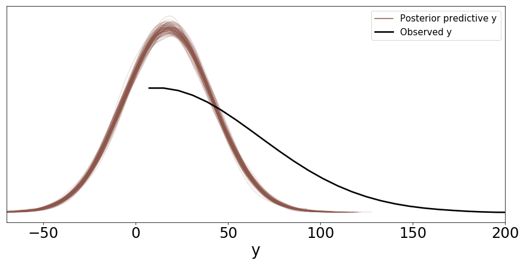
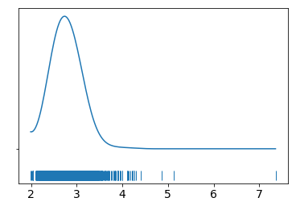
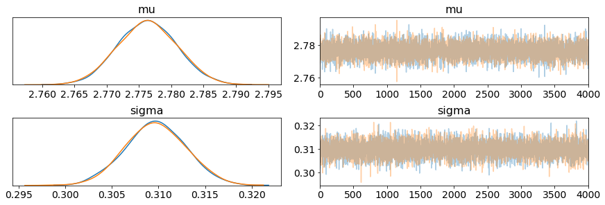
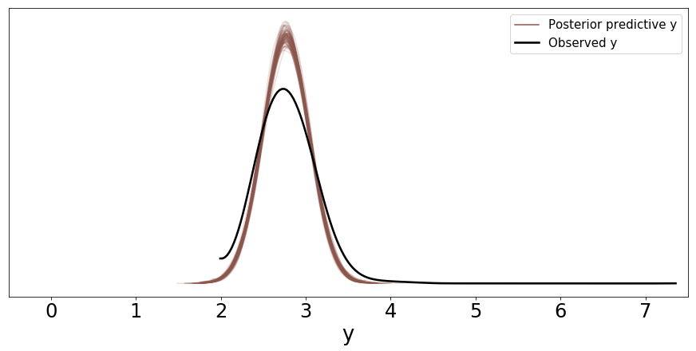
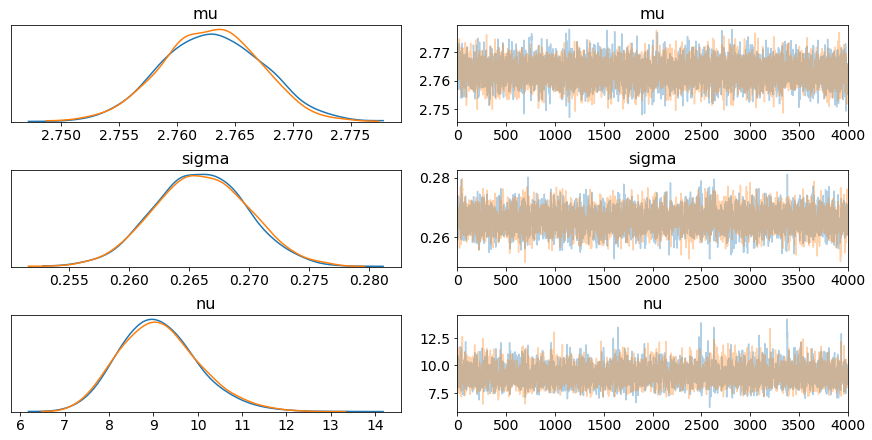
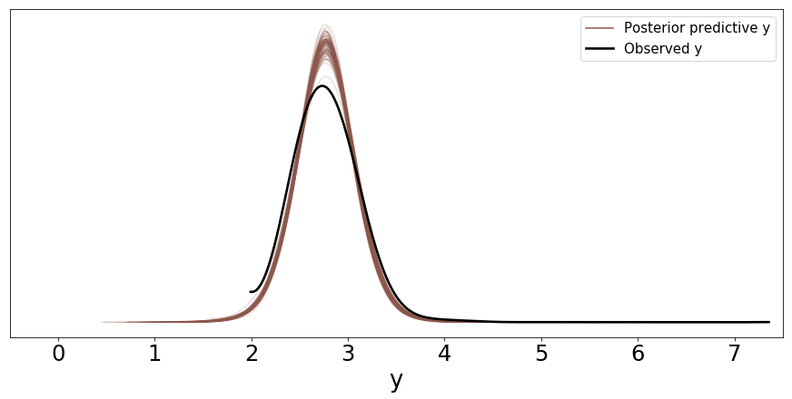

```python
import pandas as pd
import numpy as np
import pymc3 as pm
import arviz as az
import matplotlib.pyplot as plt
import seaborn as sns
```

    WARNING (theano.tensor.blas): Using NumPy C-API based implementation for BLAS functions.
    /home/corrie/.pyenv/versions/anaconda3-2019.03/lib/python3.7/site-packages/xarray/core/merge.py:17: FutureWarning: The Panel class is removed from pandas. Accessing it from the top-level namespace will also be removed in the next version
      PANDAS_TYPES = (pd.Series, pd.DataFrame, pd.Panel)


```python
d = pd.read_csv("../data/raw_data/immo_data.csv")
berlin = d.query("regio1 == 'Berlin'")
d.shape
```


    (132514, 48)


```python
berlin.shape
```


    (5008, 48)


```python
berlin.head()
```


<div>
<style scoped>
    .dataframe tbody tr th:only-of-type {
        vertical-align: middle;
    }

    .dataframe tbody tr th {
        vertical-align: top;
    }

    .dataframe thead th {
        text-align: right;
    }
</style>
<table border="1" class="dataframe">
  <thead>
    <tr style="text-align: right;">
      <th></th>
      <th>regio1</th>
      <th>serviceCharge</th>
      <th>heatingType</th>
      <th>telekomTvOffer</th>
      <th>telekomHybridUploadSpeed</th>
      <th>newlyConst</th>
      <th>balcony</th>
      <th>electricityBasePrice</th>
      <th>picturecount</th>
      <th>pricetrend</th>
      <th>...</th>
      <th>garden</th>
      <th>livingSpaceRange</th>
      <th>regio2</th>
      <th>regio3</th>
      <th>description</th>
      <th>facilities</th>
      <th>heatingCosts</th>
      <th>energyEfficiencyClass</th>
      <th>lastRefurbish</th>
      <th>date</th>
    </tr>
  </thead>
  <tbody>
    <tr>
      <td>26</td>
      <td>Berlin</td>
      <td>130.00</td>
      <td>combined_heat_and_power_plant</td>
      <td>ONE_YEAR_FREE</td>
      <td>NaN</td>
      <td>True</td>
      <td>True</td>
      <td>90.76</td>
      <td>8</td>
      <td>8.70</td>
      <td>...</td>
      <td>False</td>
      <td>1</td>
      <td>Berlin</td>
      <td>Adlershof_Treptow</td>
      <td>Das Mehrfamilienhaus in der Wassermannstraße 7...</td>
      <td>Dieses schöne 1,5-Zimmerapartment mit stilvoll...</td>
      <td>NaN</td>
      <td>A</td>
      <td>NaN</td>
      <td>Sep18</td>
    </tr>
    <tr>
      <td>114</td>
      <td>Berlin</td>
      <td>145.00</td>
      <td>central_heating</td>
      <td>ONE_YEAR_FREE</td>
      <td>NaN</td>
      <td>False</td>
      <td>False</td>
      <td>90.76</td>
      <td>5</td>
      <td>7.69</td>
      <td>...</td>
      <td>False</td>
      <td>4</td>
      <td>Berlin</td>
      <td>Marzahn_Marzahn</td>
      <td>NaN</td>
      <td>Ausstattung:\nZentralheizung, Keller, Badewann...</td>
      <td>110.00</td>
      <td>NaN</td>
      <td>2001.0</td>
      <td>Sep18</td>
    </tr>
    <tr>
      <td>134</td>
      <td>Berlin</td>
      <td>170.00</td>
      <td>central_heating</td>
      <td>ONE_YEAR_FREE</td>
      <td>10.0</td>
      <td>False</td>
      <td>True</td>
      <td>90.76</td>
      <td>17</td>
      <td>8.74</td>
      <td>...</td>
      <td>False</td>
      <td>6</td>
      <td>Berlin</td>
      <td>Charlottenburg_Charlottenburg</td>
      <td>Allgemein:\n- Saniertes Treppenhaus\n- Wärmedä...</td>
      <td>Allgemein:\n- Kabel-TV, Grundversorgung\n- Was...</td>
      <td>150.00</td>
      <td>D</td>
      <td>NaN</td>
      <td>Sep18</td>
    </tr>
    <tr>
      <td>138</td>
      <td>Berlin</td>
      <td>195.00</td>
      <td>central_heating</td>
      <td>ONE_YEAR_FREE</td>
      <td>NaN</td>
      <td>False</td>
      <td>True</td>
      <td>NaN</td>
      <td>33</td>
      <td>6.85</td>
      <td>...</td>
      <td>True</td>
      <td>6</td>
      <td>Berlin</td>
      <td>Frohnau_Reinickendorf</td>
      <td>Schöne 4-Zimmerwohnung mit anteiliger Gartenbe...</td>
      <td>- Einbauküche (gebraucht) modernisiert mit neu...</td>
      <td>140.00</td>
      <td>C</td>
      <td>2019.0</td>
      <td>May19</td>
    </tr>
    <tr>
      <td>152</td>
      <td>Berlin</td>
      <td>448.48</td>
      <td>central_heating</td>
      <td>ONE_YEAR_FREE</td>
      <td>NaN</td>
      <td>False</td>
      <td>True</td>
      <td>90.76</td>
      <td>26</td>
      <td>9.82</td>
      <td>...</td>
      <td>False</td>
      <td>6</td>
      <td>Berlin</td>
      <td>Prenzlauer_Berg_Prenzlauer_Berg</td>
      <td>Das Haus in der Greifswalder Str. 26/Ecke Käth...</td>
      <td>Helle 4 Raum Familienwohnung\n\n4 Räume:\n3 gr...</td>
      <td>224.24</td>
      <td>NaN</td>
      <td>NaN</td>
      <td>Sep18</td>
    </tr>
  </tbody>
</table>
<p>5 rows × 48 columns</p>
</div>


```python
berlin.columns
```


    Index(['regio1', 'serviceCharge', 'heatingType', 'telekomTvOffer',
           'telekomHybridUploadSpeed', 'newlyConst', 'balcony',
           'electricityBasePrice', 'picturecount', 'pricetrend',
           'telekomUploadSpeed', 'totalRent', 'yearConstructed',
           'electricityKwhPrice', 'scoutId', 'noParkSpaces', 'firingTypes',
           'hasKitchen', 'geo_bln', 'cellar', 'yearConstructedRange', 'baseRent',
           'houseNumber', 'livingSpace', 'geo_krs', 'condition', 'interiorQual',
           'petsAllowed', 'streetPlain', 'lift', 'baseRentRange', 'typeOfFlat',
           'geo_plz', 'noRooms', 'thermalChar', 'floor', 'numberOfFloors',
           'noRoomsRange', 'garden', 'livingSpaceRange', 'regio2', 'regio3',
           'description', 'facilities', 'heatingCosts', 'energyEfficiencyClass',
           'lastRefurbish', 'date'],
          dtype='object')


```python
df = berlin[['newlyConst', 'balcony', 'totalRent', 'yearConstructed', 'livingSpace', 'regio3', 'geo_plz', 'condition']]
df['sqm_rent'] = df['totalRent'] / df['livingSpace']
df.head()
```

    /home/corrie/.pyenv/versions/anaconda3-2019.03/lib/python3.7/site-packages/ipykernel/__main__.py:2: SettingWithCopyWarning: 
    A value is trying to be set on a copy of a slice from a DataFrame.
    Try using .loc[row_indexer,col_indexer] = value instead
    
    See the caveats in the documentation: http://pandas.pydata.org/pandas-docs/stable/user_guide/indexing.html#returning-a-view-versus-a-copy
      from ipykernel import kernelapp as app


<div>
<style scoped>
    .dataframe tbody tr th:only-of-type {
        vertical-align: middle;
    }

    .dataframe tbody tr th {
        vertical-align: top;
    }

    .dataframe thead th {
        text-align: right;
    }
</style>
<table border="1" class="dataframe">
  <thead>
    <tr style="text-align: right;">
      <th></th>
      <th>newlyConst</th>
      <th>balcony</th>
      <th>totalRent</th>
      <th>yearConstructed</th>
      <th>livingSpace</th>
      <th>regio3</th>
      <th>geo_plz</th>
      <th>condition</th>
      <th>sqm_rent</th>
    </tr>
  </thead>
  <tbody>
    <tr>
      <th>26</th>
      <td>True</td>
      <td>True</td>
      <td>830.00</td>
      <td>2017.0</td>
      <td>35.00</td>
      <td>Adlershof_Treptow</td>
      <td>12489</td>
      <td>first_time_use</td>
      <td>23.714286</td>
    </tr>
    <tr>
      <th>114</th>
      <td>False</td>
      <td>False</td>
      <td>764.00</td>
      <td>1985.0</td>
      <td>99.80</td>
      <td>Marzahn_Marzahn</td>
      <td>12689</td>
      <td>refurbished</td>
      <td>7.655311</td>
    </tr>
    <tr>
      <th>134</th>
      <td>False</td>
      <td>True</td>
      <td>2490.00</td>
      <td>1904.0</td>
      <td>146.86</td>
      <td>Charlottenburg_Charlottenburg</td>
      <td>14059</td>
      <td>refurbished</td>
      <td>16.954923</td>
    </tr>
    <tr>
      <th>138</th>
      <td>False</td>
      <td>True</td>
      <td>1785.00</td>
      <td>1985.0</td>
      <td>126.34</td>
      <td>Frohnau_Reinickendorf</td>
      <td>13465</td>
      <td>first_time_use_after_refurbishment</td>
      <td>14.128542</td>
    </tr>
    <tr>
      <th>152</th>
      <td>False</td>
      <td>True</td>
      <td>3139.29</td>
      <td>1914.0</td>
      <td>149.49</td>
      <td>Prenzlauer_Berg_Prenzlauer_Berg</td>
      <td>10405</td>
      <td>mint_condition</td>
      <td>21.000000</td>
    </tr>
  </tbody>
</table>
</div>


```python
data = df[(df.sqm_rent.notnull()) & (df.sqm_rent > 0)].sqm_rent.values
```


```python
az.plot_kde(data, rug=True)
plt.yticks([0], alpha=0)
plt.show()
```





```python
with pm.Model() as base_line:
    mu = pm.Normal('mu', mu=10, sd=20)
    sigma = pm.HalfNormal('sigma', sd=20)
    
    y = pm.Normal('y', mu=mu, sd=sigma, observed=data)
    
    trace = pm.sample(4000)
```

    Auto-assigning NUTS sampler...
    Initializing NUTS using jitter+adapt_diag...
    Multiprocess sampling (2 chains in 2 jobs)
    NUTS: [sigma, mu]
    Sampling 2 chains: 100%|██████████| 9000/9000 [00:05<00:00, 1769.13draws/s]
    The acceptance probability does not match the target. It is 0.8821316622512726, but should be close to 0.8. Try to increase the number of tuning steps.


```python
az.plot_trace(trace)
plt.show()
```





```python
az.summary(trace)
```


<div>
<style scoped>
    .dataframe tbody tr th:only-of-type {
        vertical-align: middle;
    }

    .dataframe tbody tr th {
        vertical-align: top;
    }

    .dataframe thead th {
        text-align: right;
    }
</style>
<table border="1" class="dataframe">
  <thead>
    <tr style="text-align: right;">
      <th></th>
      <th>mean</th>
      <th>sd</th>
      <th>hpd_3%</th>
      <th>hpd_97%</th>
      <th>mcse_mean</th>
      <th>mcse_sd</th>
      <th>ess_mean</th>
      <th>ess_sd</th>
      <th>ess_bulk</th>
      <th>ess_tail</th>
      <th>r_hat</th>
    </tr>
  </thead>
  <tbody>
    <tr>
      <th>mu</th>
      <td>17.202</td>
      <td>0.349</td>
      <td>16.543</td>
      <td>17.847</td>
      <td>0.004</td>
      <td>0.003</td>
      <td>8410.0</td>
      <td>8404.0</td>
      <td>8405.0</td>
      <td>5514.0</td>
      <td>1.0</td>
    </tr>
    <tr>
      <th>sigma</th>
      <td>23.607</td>
      <td>0.243</td>
      <td>23.174</td>
      <td>24.085</td>
      <td>0.003</td>
      <td>0.002</td>
      <td>8966.0</td>
      <td>8966.0</td>
      <td>8947.0</td>
      <td>6238.0</td>
      <td>1.0</td>
    </tr>
  </tbody>
</table>
</div>


```python
y_pred = pm.sample_posterior_predictive(trace, 100, base_line)
```

    100%|██████████| 100/100 [00:00<00:00, 720.32it/s]


```python
y_ppc = az.from_pymc3(trace=trace, posterior_predictive=y_pred)
ax = az.plot_ppc(y_ppc, figsize=(12, 6), mean=False)
ax[0].legend(fontsize=15)
plt.xlim(-70,200)
plt.show()
```





```python
log_data = np.log(data)
az.plot_kde(log_data, rug=True)
plt.yticks([0], alpha=0)
plt.show()
```





```python
with pm.Model() as log_base_line:
    mu = pm.Normal('mu', mu=0, sd=5)
    sigma = pm.HalfNormal('sigma', sd=10)
    
    y = pm.Normal('y', mu=mu, sd=sigma, observed=log_data)
    
    trace = pm.sample(4000)
```

    Auto-assigning NUTS sampler...
    Initializing NUTS using jitter+adapt_diag...
    Multiprocess sampling (2 chains in 2 jobs)
    NUTS: [sigma, mu]
    Sampling 2 chains: 100%|██████████| 9000/9000 [00:05<00:00, 1528.41draws/s]
    The acceptance probability does not match the target. It is 0.8886651338393831, but should be close to 0.8. Try to increase the number of tuning steps.
    The acceptance probability does not match the target. It is 0.9071588025785929, but should be close to 0.8. Try to increase the number of tuning steps.


```python
az.plot_trace(trace)
plt.show()
```





```python
az.summary(trace)
```


<div>
<style scoped>
    .dataframe tbody tr th:only-of-type {
        vertical-align: middle;
    }

    .dataframe tbody tr th {
        vertical-align: top;
    }

    .dataframe thead th {
        text-align: right;
    }
</style>
<table border="1" class="dataframe">
  <thead>
    <tr style="text-align: right;">
      <th></th>
      <th>mean</th>
      <th>sd</th>
      <th>hpd_3%</th>
      <th>hpd_97%</th>
      <th>mcse_mean</th>
      <th>mcse_sd</th>
      <th>ess_mean</th>
      <th>ess_sd</th>
      <th>ess_bulk</th>
      <th>ess_tail</th>
      <th>r_hat</th>
    </tr>
  </thead>
  <tbody>
    <tr>
      <th>mu</th>
      <td>2.776</td>
      <td>0.004</td>
      <td>2.768</td>
      <td>2.785</td>
      <td>0.0</td>
      <td>0.0</td>
      <td>8381.0</td>
      <td>8381.0</td>
      <td>8363.0</td>
      <td>5736.0</td>
      <td>1.0</td>
    </tr>
    <tr>
      <th>sigma</th>
      <td>0.310</td>
      <td>0.003</td>
      <td>0.304</td>
      <td>0.316</td>
      <td>0.0</td>
      <td>0.0</td>
      <td>7994.0</td>
      <td>7994.0</td>
      <td>8011.0</td>
      <td>5654.0</td>
      <td>1.0</td>
    </tr>
  </tbody>
</table>
</div>


```python
y_pred = pm.sample_posterior_predictive(trace, 100, log_base_line)
y_ppc = az.from_pymc3(trace=trace, posterior_predictive=y_pred)
ax = az.plot_ppc(y_ppc, figsize=(12, 6), mean=False)
ax[0].legend(fontsize=15)
plt.xlim(-0.5,7.5)
plt.show()
```

    100%|██████████| 100/100 [00:00<00:00, 606.55it/s]





```python
with pm.Model() as robust_log_base_line:
    mu = pm.Normal('mu', mu=0, sd=5)
    sigma = pm.HalfNormal('sigma', 10)
    nu = pm.HalfNormal('nu', 10)
    
    y = pm.StudentT('y', nu=nu, mu=mu, sd=sigma, observed=log_data)
    
    trace = pm.sample(4000)
```

    Auto-assigning NUTS sampler...
    Initializing NUTS using jitter+adapt_diag...
    Multiprocess sampling (2 chains in 2 jobs)
    NUTS: [nu, sigma, mu]
    Sampling 2 chains: 100%|██████████| 9000/9000 [00:15<00:00, 598.38draws/s]
    The acceptance probability does not match the target. It is 0.8897458374428217, but should be close to 0.8. Try to increase the number of tuning steps.
    The acceptance probability does not match the target. It is 0.8805647635518681, but should be close to 0.8. Try to increase the number of tuning steps.


```python
az.plot_trace(trace)
plt.show()
```





```python
az.summary(trace)
```


<div>
<style scoped>
    .dataframe tbody tr th:only-of-type {
        vertical-align: middle;
    }

    .dataframe tbody tr th {
        vertical-align: top;
    }

    .dataframe thead th {
        text-align: right;
    }
</style>
<table border="1" class="dataframe">
  <thead>
    <tr style="text-align: right;">
      <th></th>
      <th>mean</th>
      <th>sd</th>
      <th>hpd_3%</th>
      <th>hpd_97%</th>
      <th>mcse_mean</th>
      <th>mcse_sd</th>
      <th>ess_mean</th>
      <th>ess_sd</th>
      <th>ess_bulk</th>
      <th>ess_tail</th>
      <th>r_hat</th>
    </tr>
  </thead>
  <tbody>
    <tr>
      <th>mu</th>
      <td>2.763</td>
      <td>0.004</td>
      <td>2.755</td>
      <td>2.771</td>
      <td>0.000</td>
      <td>0.000</td>
      <td>5772.0</td>
      <td>5772.0</td>
      <td>5786.0</td>
      <td>5620.0</td>
      <td>1.0</td>
    </tr>
    <tr>
      <th>sigma</th>
      <td>0.266</td>
      <td>0.004</td>
      <td>0.259</td>
      <td>0.273</td>
      <td>0.000</td>
      <td>0.000</td>
      <td>5009.0</td>
      <td>5009.0</td>
      <td>5014.0</td>
      <td>5293.0</td>
      <td>1.0</td>
    </tr>
    <tr>
      <th>nu</th>
      <td>9.127</td>
      <td>0.894</td>
      <td>7.578</td>
      <td>10.881</td>
      <td>0.013</td>
      <td>0.009</td>
      <td>4954.0</td>
      <td>4903.0</td>
      <td>5022.0</td>
      <td>5043.0</td>
      <td>1.0</td>
    </tr>
  </tbody>
</table>
</div>


```python
y_pred = pm.sample_posterior_predictive(trace, 100, robust_log_base_line)
y_ppc = az.from_pymc3(trace=trace, posterior_predictive=y_pred)
ax = az.plot_ppc(y_ppc, figsize=(12, 6), mean=False)
ax[0].legend(fontsize=15)
plt.xlim(-0.5, 7.5)
plt.show()
```

    100%|██████████| 100/100 [00:00<00:00, 632.66it/s]





```python

```
