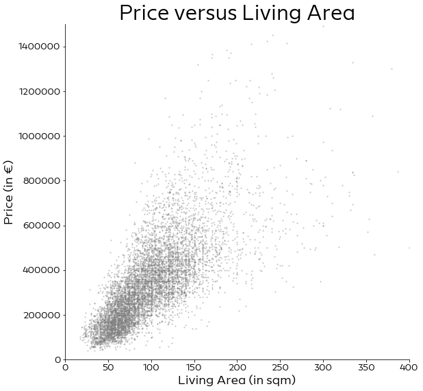
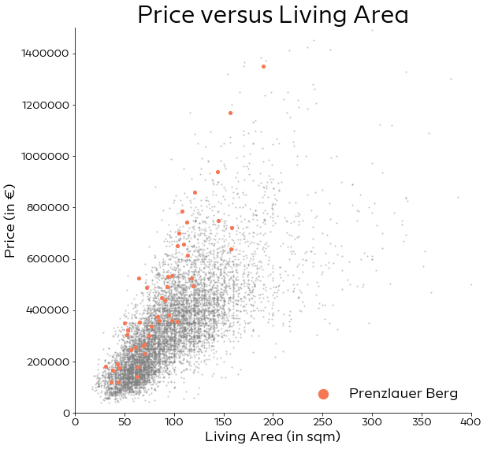
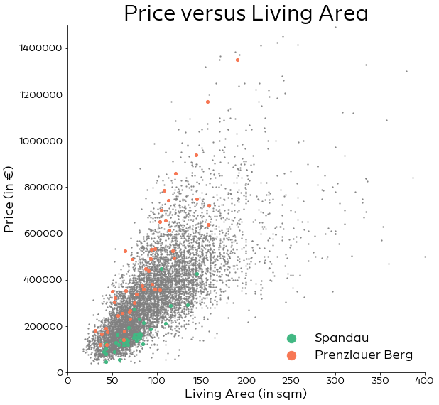
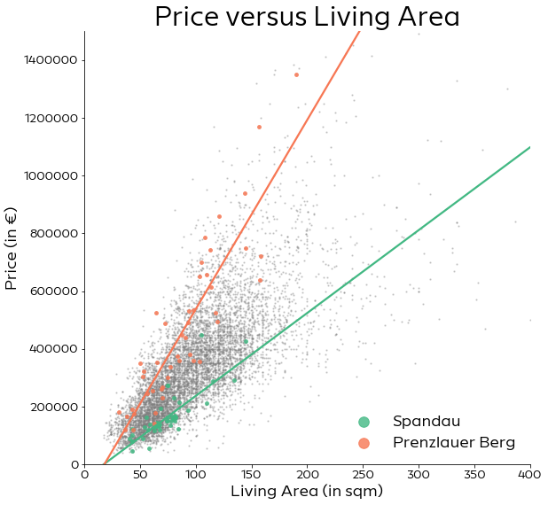
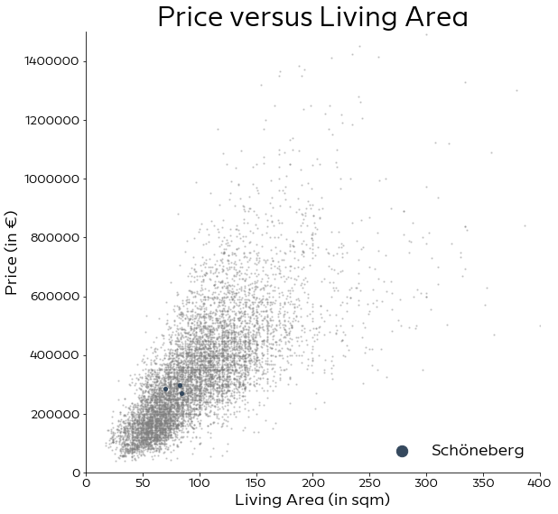
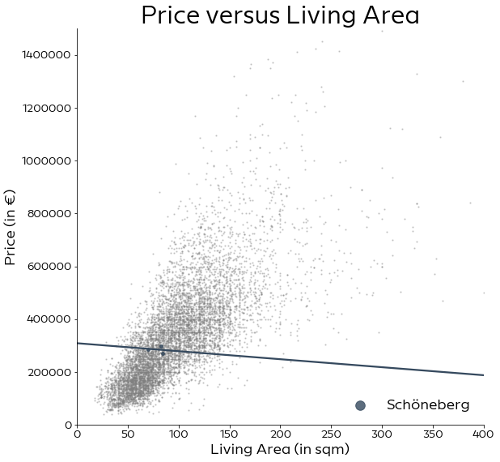
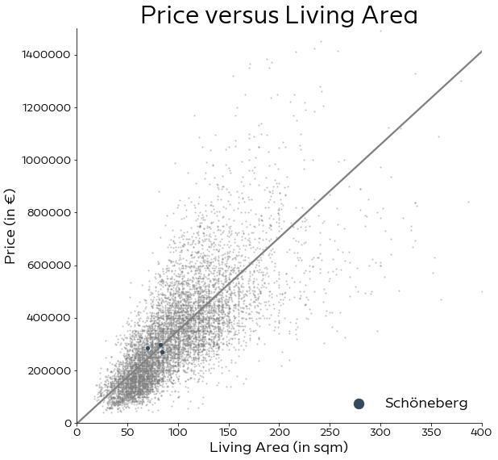

```python
import pandas as pd
import numpy as np
import matplotlib.pyplot as plt
import seaborn as sns

plt.rcParams['font.family'] = 'sans-serif'
plt.rcParams['font.sans-serif'] = 'Europace Sans'
plt.rcParams['font.size'] = 18
plt.rcParams['ytick.labelsize'] = 14
plt.rcParams['xtick.labelsize'] = 14
plt.rcParams['figure.figsize'] = 9, 9
plt.rcParams['legend.fontsize'] = 18
#plt.rcParams['figure.titlesize'] = 30
```


```python
d = pd.read_csv("../data/interim_data/houses.csv", dtype = {"ags": str, "zip": str}, index_col=0)
```


```python
fig, ax = plt.subplots()
ax.spines["top"].set_visible(False)  
ax.spines["right"].set_visible(False)
plt.ylim(0, 1500000)
plt.xlim(0, 400)
ax.scatter(d["living_space"], d["price"], s=1.8, c="gray", alpha=0.3)
ax.set_xlabel("Living Area (in sqm)")
ax.set_ylabel("Price (in €)")
ax.set_title("Price versus Living Area", fontdict={'fontsize': 30})
plt.show()
```





```python
fig, ax = plt.subplots()
ax.spines["top"].set_visible(False)  
ax.spines["right"].set_visible(False)
plt.ylim(0, 1500000)
plt.xlim(0, 400)
ax.scatter(d["living_space"], d["price"], s=1.8, c="gray", alpha=0.3)
ax.scatter(d["living_space"][d.zip == "10405"], d["price"][d.zip == "10405"], color="#f77754", s=17, label="Prenzlauer Berg")
ax.set_xlabel("Living Area (in sqm)")
ax.set_ylabel("Price (in €)")
ax.set_title("Price versus Living Area", fontdict={'fontsize': 30})
ax.legend(frameon=False, markerscale=3., loc="lower right")
plt.show()
```





```python
fig, ax = plt.subplots()
ax.spines["top"].set_visible(False)  
ax.spines["right"].set_visible(False)
plt.ylim(0, 1500000)
plt.xlim(0, 400)
ax.scatter(d["living_space"], d["price"], s=1.8, c="gray", alpha=0.3)
ax.scatter(d["living_space"][d.zip == "13583"], d["price"][d.zip == "13583"], color="#42b883", s=17, label="Spandau")
ax.scatter(d["living_space"][d.zip == "10405"], d["price"][d.zip == "10405"], color="#f77754", s=17, label="Prenzlauer Berg")
ax.set_xlabel("Living Area (in sqm)")
ax.set_ylabel("Price (in €)")
ax.set_title("Price versus Living Area", fontdict={'fontsize': 30})
ax.legend(frameon=False, markerscale=3., loc="lower right")
plt.show()
```





```python
fig, ax = plt.subplots()
ax.spines["top"].set_visible(False)  
ax.spines["right"].set_visible(False)
plt.ylim(0, 1500000)
plt.xlim(0, 400)
ax.scatter(d["living_space"], d["price"], s=1.8, c="gray", alpha=0.3)
sns.regplot(x=d["living_space"][d.zip == "13583"], y=d["price"][d.zip == "13583"], 
            color="#42b883", ax=ax, ci=0, scatter_kws={"s": 17}, label="Spandau")
sns.regplot(x=d["living_space"][d.zip == "10405"], y=d["price"][d.zip == "10405"], 
            color="#f77754", ax=ax, ci=0, scatter_kws={"s": 17}, label="Prenzlauer Berg")
ax.set_xlabel("Living Area (in sqm)", fontdict={'fontsize': 18})
ax.set_ylabel("Price (in €)", fontdict={'fontsize': 18})
ax.set_title("Price versus Living Area", fontdict={'fontsize': 30})
ax.legend(frameon=False,  markerscale=3., loc="lower right")
plt.show()
```





```python
fig, ax = plt.subplots()
ax.spines["top"].set_visible(False)  
ax.spines["right"].set_visible(False)
plt.ylim(0, 1500000)
plt.xlim(0, 400)
ax.scatter(d["living_space"], d["price"], s=1.8, c="gray", alpha=0.3)
ax.scatter(d["living_space"][d.zip == "10783"], d["price"][d.zip == "10783"], color="#35495e", s=17, label="Schöneberg")
ax.set_xlabel("Living Area (in sqm)", fontdict={'fontsize': 18})
ax.set_ylabel("Price (in €)", fontdict={'fontsize': 18})
ax.set_title("Price versus Living Area", fontdict={'fontsize': 30})
ax.legend(frameon=False,  markerscale=3., loc="lower right")
plt.show()
```





```python
fig, ax = plt.subplots()
ax.spines["top"].set_visible(False)  
ax.spines["right"].set_visible(False)
plt.ylim(0, 1500000)
plt.xlim(0, 400)
ax.scatter(d["living_space"], d["price"], s=1.8, c="gray", alpha=0.3)
sns.regplot(x=d["living_space"][d.zip == "10783"], y=d["price"][d.zip == "10783"], 
            color="#35495e", ax=ax, ci=0, scatter_kws={"s": 15}, label="Schöneberg")
ax.set_xlabel("Living Area (in sqm)", fontdict={'fontsize': 18})
ax.set_ylabel("Price (in €)", fontdict={'fontsize': 18})
ax.set_title("Price versus Living Area", fontdict={'fontsize': 30})
ax.legend(frameon=False,  markerscale=3., loc="lower right")
plt.show()
```





```python
fig, ax = plt.subplots()
ax.spines["top"].set_visible(False)  
ax.spines["right"].set_visible(False)
plt.ylim(0, 1500000)
plt.xlim(0, 400)
ax.scatter(d["living_space"], 
           d["price"], s=1.8, c="gray", alpha=0.3)
ax = sns.regplot(x=d["living_space"][(d.living_space < 200) &  (d.price < 3500000)], 
                                y=d["price"][(d.living_space < 200) &  (d.price < 3500000)], 
            color="gray", ax=ax, ci=0, scatter_kws={"s": 1.8, "alpha":0.})
ax.scatter(d["living_space"][d.zip == "10783"], d["price"][d.zip == "10783"], color="#35495e", s=17, label="Schöneberg", zorder=10)
ax.set_xlabel("Living Area (in sqm)", fontdict={'fontsize': 18})
ax.set_ylabel("Price (in €)", fontdict={'fontsize': 18})
ax.set_title("Price versus Living Area", fontdict={'fontsize': 30})
ax.legend(frameon=False,  markerscale=3., loc="lower right")
plt.show()
```





```python

```


```python

```
